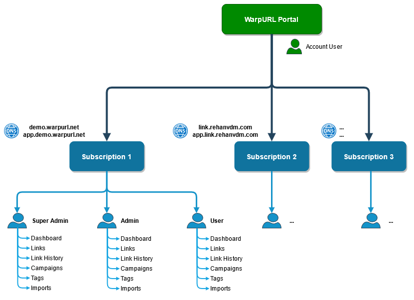

# Getting Started

## Glossary

- WarpURL Portal - Where you register and login to manage all your subscriptions & billing. [https://warpurl.com/](https://warpurl.com/)
- Subscription Portal - An instance of a Subscription that is created in WarpURL Portal, [https://app.demo.warpurl.net/](https://app.demo.warpurl.net/)
  is an example of a Subscription.
- Domain breakdown: `<protocol>://<sub-domain>.<domain>/<slug>`  

## Structure

The first step is registering the Account User on **WarpURL** at [https://warpurl.com/](https://warpurl.com/). This will be the portal
where you create and **manage one or more Subscriptions**. A Subscription is identified by its shortening domain and contains
all links, users and other entities for that shortening domain. 

Each **Subscription** has two important URLs/domains; the **shortening domain** and the **app/admin domain**. In the case of our demo,
the shortening domain is `demo.warpurl.net`, this is the base for all of the short URLs/links, example: `demo.warpurl.net/test-ping`.
The app/admin domain is `app.demo.warpurl.net`, this is where we create the above short link, tags, campaigns, imports,
manage users ect. 

## Managing Subscriptions

The Account User on the WarpURL Portal creates and manages Subscriptions. **Creating a Subscription requires** the creation of
a monthly **debit order using PayPal**. **A Domain is also required with access to its Hosted Zone to create 4 DNS records.**

Subscriptions are billed and invoiced individually. All invoices are stored in the WarpURL Portal and emailed to the Account User. 
Payment arrangements like grouping multiple Subscriptions into a single payment and invoice is possible at volumes,
please contact support if this is required. 

See the sections below for more information:

- [Subscriptions](../managing-subscriptions/subscription.html)
  - [New Subscription](../managing-subscriptions/subscription.html#new-subscription)
  - [View Subscription](../managing-subscriptions/subscription.html#view-subscription)
  - [Update Subscription](../managing-subscriptions/subscription.html#update-subscription)
  - [Delete Subscription](../managing-subscriptions/subscription.html#delete-subscription)
- [Billing & Invoicing](../managing-subscriptions/billing_and_invoicing.html)
  - [Overview](../managing-subscriptions/billing_and_invoicing.html#overview)
  - [Invoices](../managing-subscriptions/billing_and_invoicing.html#invoices)

## Subscription

A Subscription can have **multiple users** (Super Admin/Admin/User) with varying permissions. 
Each user only has access to their own data such as Links, Dashboard, Campaigns, Imports, Access Keys ect. 
Users can be **assumed/impersonated** to "share" their data between each other if needed. 

A Link can have **multiple Tags** but only a **single Campaign** and Campaign Channel. 
The slug can be specified or left empty to use an auto generated random value. 

Links can be **viewed by**; newest first, by Campaign, by Tags or **most/least popular** over all time - that month - or that day.

All the basic information for a link is recorded; total clicks, monthly clicks, daily clicks, hourly clicks and unique clicks are tracked. 
When available we also record the following; locations (the closest major country & city), top referrers, devices, operating system, browser and human vs. bot clicks.
**Processing history** of links to create statistics is done in batches and **near real time** (approximately 5 minutes).

See the sections below for more information:

- [Users](../subscription/#users)
- [Links](../subscription/#links)
- [Link History](../subscription/#link-history)
- [Imports](../subscription/#imports)
- [Campaigns](../subscription/#campaigns)
- [Tags](../subscription/#tags)
 

## API

Every action seen on the frontend can be accessed using the API. 

All API calls are:
- POST requests.
- Uses JSON for both request and response.
- Always return HTTP Status Code 200 and contains a `control.ResponseCode` that needs to be evaluated for success.

Authentication is done via two headers.
The first being the **API Key** (`x-api-key`) obtained from the WarpURL portal by viewing that Subscription details,
it is just used to isolate traffic of that Subscription. 
The second being the user's **Access Key** (`Authorization`) that is a JWT ID Token used to identify the user when doing the
requests.

See the sections below for more information:

- [General](../api/)
  - [Request Structure](../api/#request-structure)
  - [Response Structure](../api/#response-structure)
  - [Authentication](../api/#authentication)
- [Models](../api/model.html)
  - [Link](../api/model.html#link)
  - [Link History Hourly](../api/model.html#link-history-hourly)
  - [Link History Daily](../api/model.html#link-history-daily)
  - [Campaign](../api/model.html#campaign)
  - [Import](../api/model.html#import)
  - [Access Key](../api/model.html#access-key)
  - [Client](../api/model.html#client)
  - [User](../api/model.html#user)
- [Requests](../api/link.html)
  - [Links](../api/link.html#links)
  - [Campaigns](../api/campaign.html#campaigns)
  - [Imports](../api/db_import.html#imports)
  - [Access Keys](../api/access_key.html#access-keys)
  - [User](../api/user.html#user)
  - [Client](../api/client.html#client)

 
