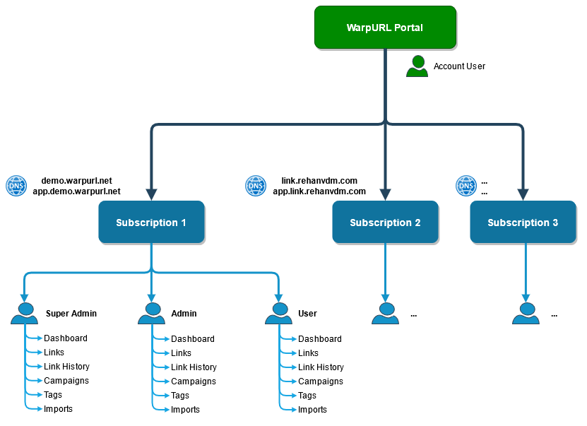

# Overview

## Glossary

- WarpURL Portal - Where you register and login to manage all your subscriptions & billing. [https://warpurl.com/](https://warpurl.com/)
- Subscription Portal - An instance of a Subscription that is created in WarpURL Portal, [https://app.demo.warpurl.net/](https://app.demo.warpurl.net/)
  is an example of a Subscription.
- Domain breakdown: `<protocol>://<sub-domain>.<domain>/<slug>`  

## Structure

First steps is registering a user on **WarpURL** at [https://warpurl.com/](https://warpurl.com/). This will be the portal
where you create and **manage one or more Subscriptions**. A Subscription is identified by its shortening domain and contains
all links, users and other entities for that shortening domain. 

Each **Subscription** has two important URLs/domains; the **shortening domain** and the **app/admin domain**. In the case of our demo,
the shortening domain is `demo.warpurl.net`, this is the base of all the short URLs/links, example: `demo.warpurl.net/test-ping`.
The app/admin domain is `app.demo.warpurl.net`, this is where we create the above short link, tags, campaigns, imports,
manage users ect. 

## Managing Subscriptions

## Subscription
