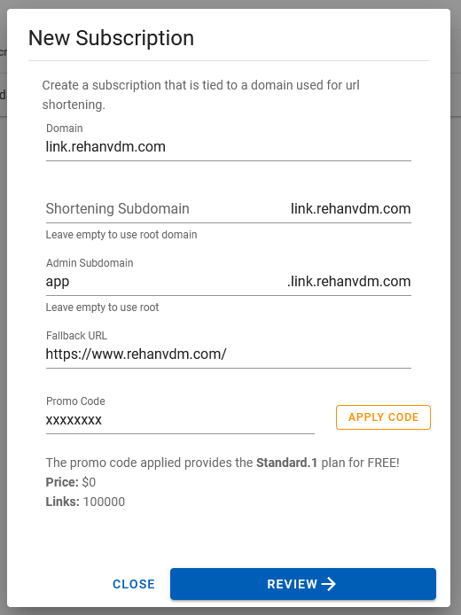
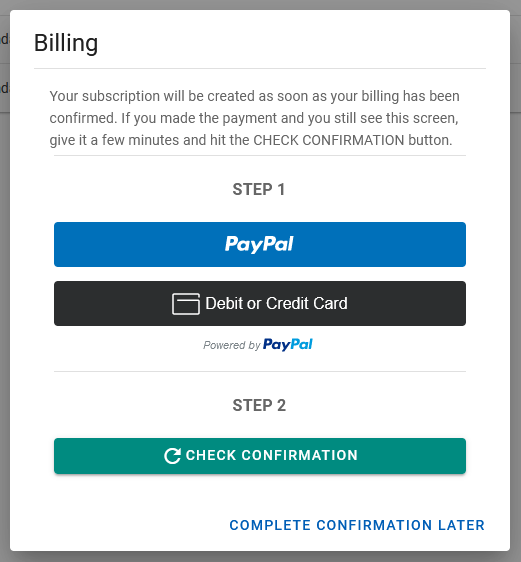
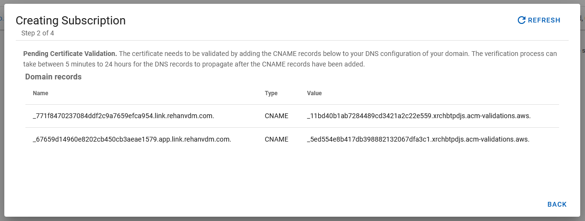
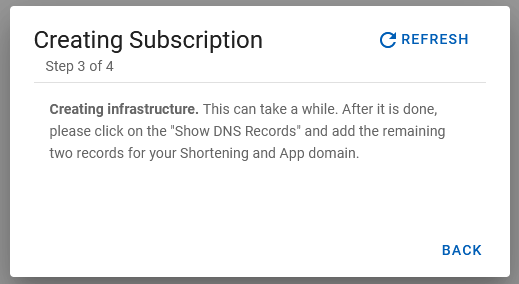
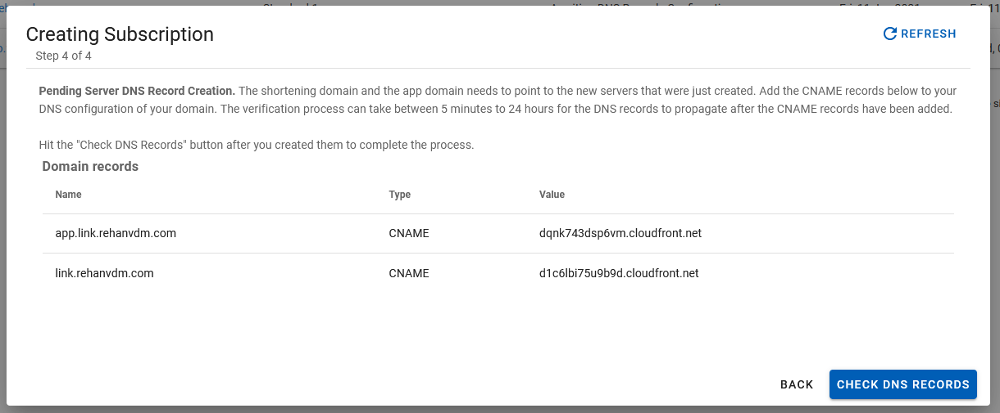
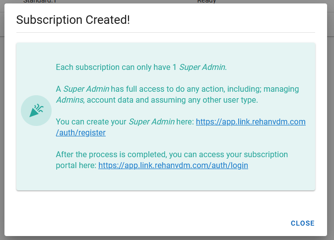
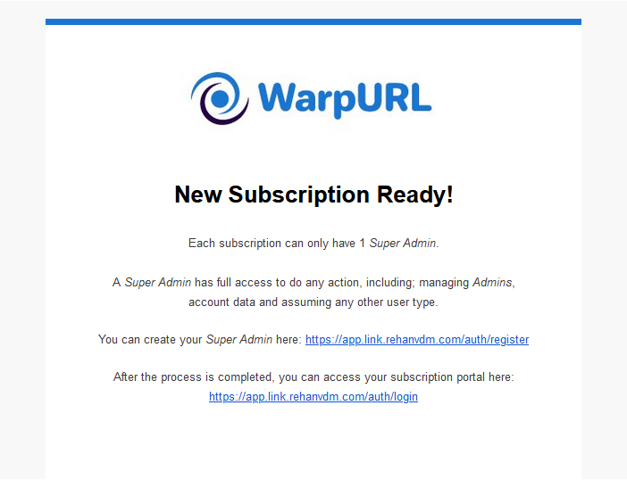
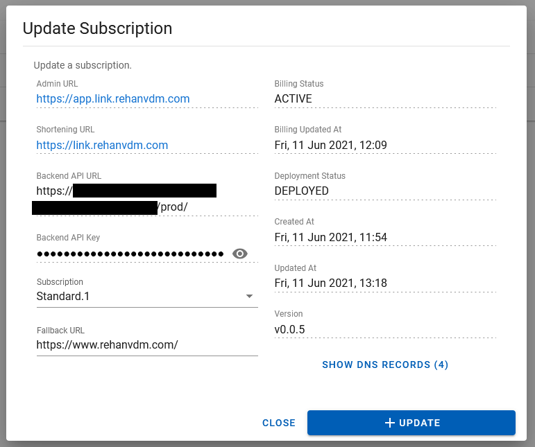
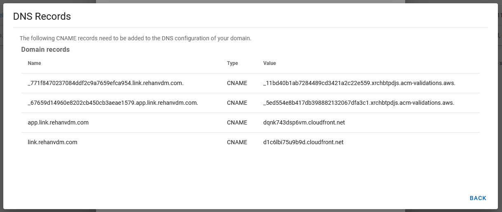

# Subscriptions

A Subscription is identified by its shortening domain and contains all links, users and other entities for that shortening
domain.

[[toc]]

::: warning NOTE
Request early access [here](https://warpurl.com/) by clicking SIGN UP to receive a registration link and promo code.
:::

::: tip EXPLORE THE DEMO
A picture is worth a thousand words, but a demo is worth a million. Interact directly with the Demo Subscription here:
[app.demo.warpurl.net](https://app.demo.warpurl.net) to see all the features in action.
:::

Login to WarpURL after registering at [https://warpurl.com/](https://warpurl.com/). Navigate to the
[Subscriptions](https://warpurl.com/app/subscriptions) using the left hand side menu.

_Images on this page *might be outdated_

---

## New Subscription

Click on the NEW SUBSCRIPTION button that can be found on the [Subscriptions](https://warpurl.com/app/subscriptions) page.

::: danger IMPORTANT
If you are not a technical person, please run the overview below by your team/technical person that will help you.
Do this BEFORE you start.

- You require a new or existing domain.
- You will need access to your domain's DNS zone to add DNS records in order to complete the process.
:::

#### Overview

These are the general steps involved to create a new subscription:

1. Enter the selected details to create a new Subscription. Choose the correct Pricing Plan OR enter a Promo Code.
1. Complete the Billing section by setting up the monthly subscription using PayPal. A credit card or PayPal account is needed for this step.
1. Create 2 DNS records so that we know you own the domains and can issue SSL certificates for those domains.
1. Wait for confirmation of the above DNS records. Propagation can take anything from 5 minutes to 24 hours, usually it is just a few minutes.
1. After confirmation is received, we create the infrastructure for the Subscription. This usually takes about 15 minutes.
1. Another 2 DNS records need to be created to point the specified domains (Shortening and Admin) to the Subscription infrastructure endpoints created above.
1. The Subscription is now usable! Create the first Subscription user which is the Super Admin at `https://<your-admin-domain>/auth/register`. 
    Instructions would also have been sent via email. 
   

#### Step-by-step

Let's look at each step in more detail.

---

- `Domain` is the base of the domain, allowing us to only specify the Subdomains below. 
- `Shortening Subdomain` Leaving this field blank will make the Domain the Shortening Domain as in the example above. 
  Any value can be specified that is DNS complaint.
- `Admin Subdomain` is the Subdomain that specifies the address of the portal to manage everything.
    Values like `app` or `admin` is common values.
- `Fallback URL` is the URL that a user clicking a link will be navigated to IF a link does not exist. 
- `Promo Code` can be obtained through email after requesting early access. Significant discount, like above, can be applied with certain coeds.
    In the example above, the Subscription is free for up to 100k links and thus the next step of capturing the billing details 
    is not required. 

---

At this step we capture your payment method for the monthly subscription and the one time only setup fee. Two payment methods are
available:

- Debit or Credit card
- Directly through PayPal

Both methods are processed and **secured by PayPal**, we don't store any credit card information. Choosing either will make a PayPal popup window appear
so that you can create the Debit Order and pay the immediate one time only setup fee. 

When done, the window will be closed and PayPal will send you an email for confirmation of the purchase. WarpURL is a 
brand company of **Systanics** or __PAYPAL *SYSTANICS__, do not be alarmed if you see this on the invoice.

You can also expect an invoice from us shortly there after for the setup fee.

It takes a few minutes for PayPal to notify us of your payment. Please wait a few minutes after creating the payment and 
then click the CHECK CONFIRMATION button to continue. Contact support if 1 hour has elapsed and you can still not 
continue to the next step.

---

Next you need to create 2 CNAME DNS records so that we know you own the domain(s) and that we can issue SSL certificates for those domains.

::: warning IMPORTANT
The values in the image above is just an example, your values will be different. 
:::

The verification process can take between 5 minutes to 24 hours for the DNS records to propagate after the CNAME records have been added.

You can hit the REFRESH button in the top right corner to check if the records have propagated and exist. As soon as they do, we start creating
the infrastructure.

---

It takes about 15 minutes to create the infrastructure for your Subscription, again hit the REFRESH button in the top right corner 
to move to the next step. 

---

The infrastructure has now been created. All that is left is to point the Shorting domain and Admin domain to the newly 
provisioned infrastructure. This is done by creating the last 2 DNS CNAME records. 

::: warning IMPORTANT
The values in the image above is just an example, your values will be different.
:::

The verification process can take between 5 minutes to 24 hours for the DNS records to propagate after the CNAME records have been added.

Clicking the CHECK DNS RECORDS button will verify that the DNS records are present and correct. 

---

Congratulations, you have completed the process! 

You should now see a page with instructions on how to register the first user on your Subscription portal. The first user
is always the SuperAdmin that has full access to that Subscription's data.

The instructions on this screen will also be sent via email similar to the one below:

---
---
---

## View Subscription

Navigate to the [Subscriptions](https://warpurl.com/app/subscriptions) page. 
Click on the Subscription name within the data grid or the pencil button on the right hand side of that Subscription row
to view its data.

- `Backend API URL` is the URL that can be used to directly interact with your Subscription via API. See the API docs for more information.
- `Backend API Key` is used to identify all requests for that Subscription. It can not be rotated, as it is only used to separate and rate limit API traffic per Subscription.
  See the API docs for more information.
- `Subscription` can be changed to move to a higher or lower pricing plan.
- `Billing Status` will reflect the current payment status for that specific Subscription.
- `Deployment Status` indicates if the current state the Subscription is in. It will mostly be in DEPLOYED meaning ready for use.
    Updating is prohibited when the status is already in the UPDATING state. Contact support if the Subscription is ever in the 
    ERROR state. 
- `Created At` and `Deployed At` indicates the times the Subscription was created and updated at, in UTC. 
- `Version` specifies the version the current Subscription is at. This is only informational and nothing to be concerned about. 
    Mainly used for API integrators.

The SHOW DNS RECORDS button will display all the current DNS records for the Subscription. 

---
---
---

## Update Subscription

Navigate to the [Subscriptions](https://warpurl.com/app/subscriptions) page.
Click on the Subscription name within the data grid or the pencil button on the right hand side of that Subscription row
to view its data.

Similar to the *View Subscription* section above.

Currently, the only fields that can be changed are the `Fallback URL` and the `Subscription` field. Changing the `Subscription`
to a higher or lower pricing plan also requires the update of the debit order. Another PayPal workflow similar to creating 
a Subscription needs to be completed before changing the pricing plan. No setup fee is required. 

Updating usually takes around 15 minutes. 

---
---
---

## Delete Subscription

Navigate to the [Subscriptions](https://warpurl.com/app/subscriptions) page.

A Subscription can be deleted by clicking on the trashcan button on the right hand side of that Subscription row within the data grid.
This will present a popup that if accepted will change the Subscription to a status of DELETE_REQUESTED. 

It can take upto 72 hours for the Subscription to be removed, you will not be charged the period between DELETE_REQUESTED 
and the actual deletion of the data. We might contact you via email during this period. 

